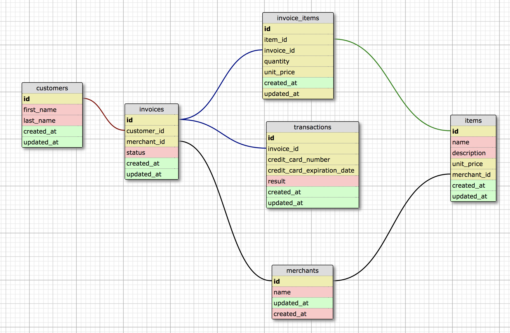

# Rails Sales Engine
## Application Overview
This application is designed to execute business analytic queries against an actual e-commerce business dataset (sanitized).  
A JSON API is built using Rails and ActiveRecord which exposes the relationships within the database and peforms complex analytic queries.  This is a collaborative project between Joseph Jobes and Andrew Jeffery while attending the Back End Engineering Program at the Turing School of Software & Design.  

## Database Design / Schema


## Setup
To run the rails engine on your local machine, please use the following setup steps:

* Clone down the repo onto your local machine
```
$ git clone https://github.com/amj133/rails-engine.git
```
* Navigate to the rails-engine directory and bundle to add all necessary gems
```
$ bundle install
```
* Then to setup and load the database run the following commands
```
$ rails db:create
$ rails db:migrate
$ rake load_sales_data:all
```
* If you wish to import specific data please run any of these commands for the specific type you would like
```
$ rake load_sales_date:load_all_merchants       # for all merchants
$ rake load_sales_date:load_all_customers       # for all customers
$ rake load_sales_date:load_all_invoices        # for all invoices
$ rake load_sales_date:load_all_items           # for all items
$ rake load_sales_date:load_all_invoice_items   # for all invoice items
$ rake load_sales_date:load_all_transactions    # for all transactions
```

## Testing 
* Rails Engine has a fully fleshed out rspec test suite. If you would like to run the tests please execute this command in the terminal.
```
$ rspec
```
* If you are running an older version of rspec then run
```
$ bundle exec rspec
```

## Interacting with the API
### Resources to be displayed:
* Merchants
* Customers
* Invoices
* Items
* Invoice Items
* Transactions

### Record Endpoints
An index of each resource is available by visiting version 1 of the API followed by the resource name (plural).  
For example, to access all of the merchants or invoice items send a GET request with the following url:
  * /api/v1/merchants
  * /api/v1/invoice_items

To visit an individual resource visit version 1 of the API followed by the resource name (plural) and its id.  
For example, to access a specific merchant or invoice item send a GET request with the following url:
  * /api/v1/merchants/1
  * /api/v1/invoice_items/3

To find a record by a specific attribute visit version 1 of the API followed by the resource name (plural), find, and the attribute name and value as query string parameters.  For example, to access a specific merchant by their name:
  * /api/v1/merchants/find?name=Janes%20Shop

To find multiple records by a specific attribute or specific attributes, visit version 1 of the API followed by the resource name (plural), find_all, and all of the attribute names and values as query string parameters.  For example, to access a specific item by their name and unit_price:
  * /api/v1/items/find_all?name=bouncy%20ball&unit_price=2.25

Or to simply access all the items with unit price = $2.25:
  * /api/v1/items/find_all?unit_price=2.25

You can also access a random record for each resource by visiting version 1 of the API followed by the resource name (plural) and random:
  * /api/v1/items/random
  
### Record Relation Endpoints
The URL's below will display the record relations for each resource:

#### Merchants
  * GET /api/v1/merchants/:id/items returns a collection of items associated with that merchant
  * GET /api/v1/merchants/:id/invoices returns a collection of invoices associated with that merchant from their known orders

#### Invoices
  * GET /api/v1/invoices/:id/transactions returns a collection of associated transactions
  * GET /api/v1/invoices/:id/invoice_items returns a collection of associated invoice items
  * GET /api/v1/invoices/:id/items returns a collection of associated items
  * GET /api/v1/invoices/:id/customer returns the associated customer
  * GET /api/v1/invoices/:id/merchant returns the associated merchant 

#### Invoice Items
  * GET /api/v1/invoice_items/:id/invoice returns the associated invoice
  * GET /api/v1/invoice_items/:id/item returns the associated item

#### Items
  * GET /api/v1/items/:id/invoice_items returns a collection of associated invoice items
  * GET /api/v1/items/:id/merchant returns the associated merchant

#### Transactions
  * GET /api/v1/transactions/:id/invoice returns the associated invoice

#### Customers
  * GET /api/v1/customers/:id/invoices returns a collection of associated invoices
  * GET /api/v1/customers/:id/transactions returns a collection of associated transactions
  
### Business Analytic Endpoints
The URL's below will display business analytics for specified resources:

#### All Merchants
  * GET /api/v1/merchants/most_revenue?quantity=x returns the top x merchants ranked by total revenue
  * GET /api/v1/merchants/most_items?quantity=x returns the top x merchants ranked by total number of items sold
  * GET /api/v1/merchants/revenue?date=x returns the total revenue for date x across all merchants, see below for example date format     
  * Example date format for queries: 2018-04-12T16:55:41

#### Single Merchant
  * GET /api/v1/merchants/:id/revenue returns the total revenue for that merchant across successful transactions
  * GET /api/v1/merchants/:id/revenue?date=x returns the total revenue for that merchant for a specific invoice date x
  * GET /api/v1/merchants/:id/favorite_customer returns the customer who has conducted the most total number of successful transactions.
  * GET /api/v1/merchants/:id/customers_with_pending_invoices returns a collection of customers which have pending (unpaid) invoices. A pending invoice has no transactions with a result of success. 

#### Items
  * GET /api/v1/items/most_revenue?quantity=x returns the top x items ranked by total revenue generated
  * GET /api/v1/items/most_items?quantity=x returns the top x item instances ranked by total number sold
  * GET /api/v1/items/:id/best_day returns the date with the most sales for the given item using the invoice date.
  
## Authors
Joseph Jobes @AtmaVichara
Andrew Jeffery @amj333
